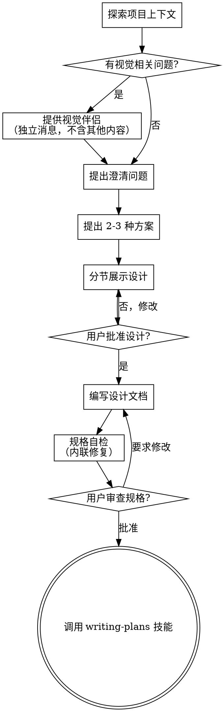

# 头脑风暴：将想法转化为设计

通过自然的协作对话，帮助将想法转化为完整的设计和规格说明。

首先了解当前项目的上下文，然后逐一提问来完善想法。一旦你理解了要构建的内容，就展示设计方案并获得用户批准。

## 交互语言（强制）

**提问和方案展示用大白话**：用户是业务方，需求澄清阶段禁用开发黑话（要说「生成订单
报告」不说「触发 recalc」），必须用术语时先给一句大白话解释（可查 docs/CONTEXT.md）。
设计文档本身仍按开发者规范写（技术密度保留），只是「问人的话」和「给人拍板的方案」
必须让业务方能看懂。

## 前置输入

如果存在同主题的**需求澄清记录**（`specs/<迭代>/*-需求分析.md`，由
requirement-grilling 技能产出且状态「已确认」）：以其为准——跳过澄清问题段，直接从
方案探索开始，且不得推翻澄清文档里用户已裁定的分支（要推翻必须回澄清文档改并注明）。

**栏目制语境**：若本功能处于某栏目 S4 内（见 `docs/planning/`），前置输入还包括该功能的
**功能级 PRD**（requirement-grilling 升格产物，含 AC + 明确不做）与栏目 PRD 基线
（`docs/planning/modules/NN-*/product-requirements.md`）——方案不得突破两者冻结的边界，
要突破先回上层改（权威链见 planning/project-status.md §3）。

<HARD-GATE>
在你展示设计方案并获得用户批准之前，不要调用任何实现技能、编写任何代码、搭建任何项目或采取任何实现行动。这适用于所有项目，无论看起来多简单。
</HARD-GATE>

## 反模式："这个太简单了，不需要设计"

每个项目都要经过这个流程。一个待办事项列表、一个单函数工具、一个配置变更——全都需要。"简单"的项目恰恰是未经检验的假设造成最多浪费的地方。设计可以很简短（对于真正简单的项目几句话就够了），但你必须展示出来并获得批准。

## 检查清单

你必须为以下每个条目创建任务，并按顺序完成：

1. **探索项目上下文** — 检查文件、文档、最近的 commit
2. **提供视觉伴侣**（如果主题涉及视觉问题）— 这是一条独立的消息，不要与澄清问题合并。参见下方的"视觉伴侣"部分。
3. **提出澄清问题** — 每次一个，了解目的/约束/成功标准
4. **提出 2-3 种方案** — 附带权衡分析和你的推荐
5. **展示设计** — 按复杂度分节展示，每节展示后获得用户批准
6. **编写设计文档** — 保存到 `specs/<迭代>/YYYY-MM-DD-<topic>-design.md`（批次级 bN-spec 与功能级 design 双形态同居的 spec 目录体系），**同一次 commit 在 INDEX.md 追加登记行**（列：条目/标题/状态/所在位，双形态统一登记，规则见 INDEX.md 头部）（**必含四节**，见「设计之后」）
7. **规格自检** — 快速内联检查占位符、矛盾、模糊性、范围（详见下方）
8. **用户审查书面规格** — 在继续之前请用户审查规格文件
9. **过渡到实现** — 调用 writing-plans 技能创建实现计划

## 流程图

**终止状态是调用 writing-plans。** 不要调用 frontend-design、mcp-builder 或任何其他实现技能。头脑风暴之后你唯一要调用的技能是 writing-plans。

## 流程详述

**理解想法：**

- 首先查看当前项目状态（文件、文档、最近的 commit）
- 在提出详细问题之前，先评估范围：如果需求描述了多个独立子系统（例如"构建一个包含聊天、文件存储、计费和分析的平台"），立即指出这一点。不要花时间用问题去细化一个需要先拆分的项目。
- 如果项目规模过大，单个规格说明无法覆盖，帮助用户分解为子项目：有哪些独立的部分，它们之间有什么关系，应该按什么顺序构建？然后通过正常的设计流程进行第一个子项目的头脑风暴。每个子项目都有自己的规格 → 计划 → 实现周期。
- 对于范围适当的项目，每次提一个问题来完善想法
- 尽量使用选择题，开放式问题也可以
- 每条消息只提一个问题——如果一个主题需要更多探索，拆分成多个问题
- 重点理解：目的、约束、成功标准

**探索方案：**

- 提出 2-3 种不同的方案及其权衡
- 以对话的方式展示选项，附上你的推荐和理由
- 先展示你推荐的方案并解释原因

**展示设计：**

- 一旦你认为理解了要构建的内容，就展示设计
- 每个部分的篇幅与其复杂度匹配：简单的几句话，复杂的最多 200-300 字
- 每个部分展示后询问是否正确
- 涵盖：架构、组件、数据流、错误处理、测试
- 随时准备回头澄清不明确的地方

**面向隔离和清晰的设计：**

- 将系统拆分为更小的单元，每个单元有一个明确的职责，通过定义良好的接口通信，可以独立理解和测试
- 对于每个单元，你应该能回答：它做什么，如何使用，它依赖什么？
- 别人能否不看内部实现就理解一个单元的功能？你能否在不影响调用者的情况下修改内部实现？如果不能，边界需要调整。
- 更小、边界清晰的单元也更便于你工作——你对能一次放入上下文的代码推理得更好，文件越专注你的编辑越可靠。当文件变大时，这通常意味着它承担了过多职责。

**在现有代码库中工作：**

- 在提出更改之前先探索现有结构。遵循现有模式。
- 如果现有代码存在影响当前工作的问题（例如文件过大、边界不清、职责纠缠），在设计中包含有针对性的改进——就像一个优秀的开发者在工作中改进经手的代码一样。
- 不要提议无关的重构。专注于服务当前目标的事情。

## 设计之后

**文档：**

- 将验证通过的设计（规格说明）写入 `specs/<迭代>/YYYY-MM-DD-<topic>-design.md`
  - （用户对规格位置的偏好优先于此默认值）
- **必含四节（缺失 review 退回，AGENTS.md 规范）**：
  1. **旧链清退盘点** — 被替换旧链的调用面清单+逐项处置（死代码删除/保留原因）
  2. **结构影响评估** — 文件归位/拆分目标、触及文件行数
  3. **往返账预估** — DB 读写往返与批量化设计（N+1 检查）
  4. **资产回写盘点** — 本变更影响哪份项目领域现状文档 / 是否产生新 ADR（三道门）/ `docs/CONTEXT.md` 术语增改 / **项目用户文档是否需同步**
- 帮助文档同步判据：**用户能看见的界面/操作/文案变了才同步**（交互变化）；
  纯后端内部变化（性能/缓存/重构/内部链路）不动帮助页。
- 如果可用，使用 elements-of-style:writing-clearly-and-concisely 技能
- 将设计文档 commit 到 git
- 新 spec 落档使旧 spec 被覆盖时：旧 spec 头部回写状态标注 + `git mv` 至 `specs/archive/<迭代>/`，同名 plan 跟随（谁改状态谁搬移；迭代 S7 收口=整族目录原地冻结成档案，historical/active 留主目录）

**规格自检：**
编写规格文档后，以全新的视角审视它：

1. **占位符扫描：** 有没有"待定"、"TODO"、未完成的章节或模糊的需求？修复它们。
2. **内部一致性：** 各章节之间有矛盾吗？架构和功能描述匹配吗？
3. **范围检查：** 这是否聚焦到可以用一个实现计划覆盖，还是需要进一步拆分？
4. **模糊性检查：** 有没有需求可以被两种方式理解？如果有，选择一种并明确写出来。
5. **INDEX 登记核对：** 登记行存在、分组正确、状态列显式如实（不吃「无标注=active」默认）。

发现问题就直接内联修复。无需重新审查——修好继续推进。

**用户审查关卡：**
规格自检完成后，请用户在继续之前审查书面规格：

> "规格已编写并 commit 到 `<path>`。请审查一下，如果在我们开始编写实现计划之前你想做任何修改，请告诉我。"

等待用户回复。如果他们要求修改，做出修改并重新运行规格自检。只有在用户批准后才继续。

**实现：**

- 调用 writing-plans 技能创建详细的实现计划
- 不要调用任何其他技能。writing-plans 是下一步。

## 核心原则

- **每次一个问题** — 不要同时抛出多个问题
- **优先选择题** — 在可能的情况下比开放式问题更容易回答
- **严格遵循 YAGNI** — 从所有设计中移除不必要的功能
- **探索替代方案** — 在做决定之前始终提出 2-3 种方案
- **增量验证** — 展示设计，获得批准后再继续
- **保持灵活** — 有不明确的地方就回头澄清

## 视觉伴侣

一个基于浏览器的伴侣工具，用于在头脑风暴过程中展示原型、图表和视觉选项。它是一个工具——不是一种模式。接受伴侣意味着它可用于适合视觉呈现的问题；并不意味着每个问题都要通过浏览器。

**提供伴侣：** 当你预计后续问题会涉及视觉内容（原型、布局、图表）时，提供一次以获得同意：
> "我们接下来讨论的一些内容，如果能在浏览器中展示给你看可能会更直观。我可以在讨论过程中为你制作原型、图表、对比图和其他视觉材料。这个功能还比较新，可能会消耗较多 token。要试试吗？（需要打开一个本地 URL）"

**此提议必须是一条独立的消息。** 不要将它与澄清问题、上下文摘要或任何其他内容合并。消息中应该只包含上述提议，没有其他内容。等待用户回复后再继续。如果他们拒绝，继续纯文本的头脑风暴。

**逐问题决策：** 即使用户接受了，也要对每个问题单独决定是使用浏览器还是终端。判断标准：**用户看到它是否比读到它更容易理解？**

- **使用浏览器** 展示本身就是视觉的内容——原型、线框图、布局对比、架构图、并排视觉设计
- **使用终端** 展示文本内容——需求问题、概念选择、权衡列表、A/B/C/D 文字选项、范围决策

关于 UI 主题的问题不一定是视觉问题。"在这个上下文中个性化是什么意思？"是一个概念问题——使用终端。"哪种向导布局更好？"是一个视觉问题——使用浏览器。

如果他们同意使用伴侣，在继续之前阅读详细指南：
`skills/brainstorming/visual-companion.md`（本文件未随本技能包移植，可在 superpowers 原仓库获取）

> 来源：取材自 [superpowers-zh](https://github.com/jnMetaCode/superpowers-zh)（中文社区版，MIT；上游 [obra/superpowers](https://github.com/obra/superpowers)），移植时有最小脱敏改写。
