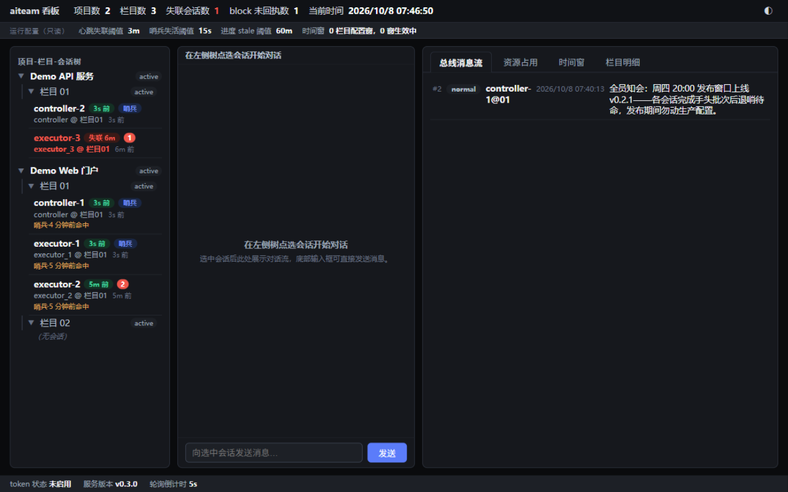
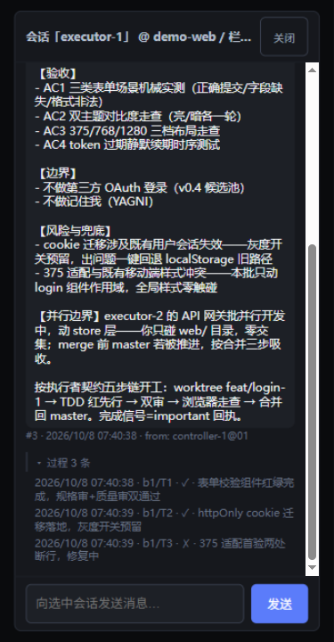
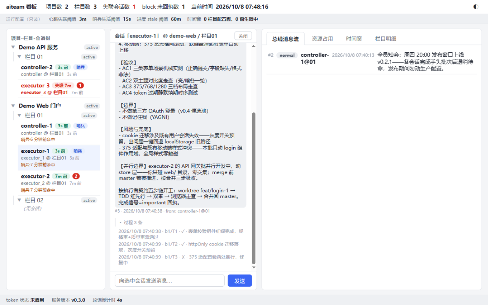

# aiteam

开源的「借助 AI 快速实现企业级项目开发」组合体：**跨机分布式多会话通讯中枢（软件）+ S0~S7 多会话流水线开发方法论（文档包）**，MIT 协议发布。

**跨机器、跨客户端、人远程盯全局**：一台服务机、多台开发机、任意 AI 客户端（zcode / Claude Code 等一切可调 bash 的会话工具）——散布在各台电脑上的 AI 会话经 CLI 接入同一个消息中枢（不丢不重+哨兵唤醒），按文档包方法论组成一支并行开发团队；人从浏览器看板远程监督全局、按会话对话、随时插话。单机起步、随时扩多机（客户端只改服务地址，零迁移成本）。

```
 开发机 A (zcode)          开发机 B (Claude Code)          任何浏览器
 ─ executor_A ──┐          ─ executor_B ──┐                 ┌─ 看板(全局+对话) ─
                ▼                          ▼                 ▼
          ╔═════════════════════════════════════════════════════╗
          ║   服务机：aiteam serve（单二进制 · SQLite · :8310）   ║
          ║   消息必达（库存储+哨兵唤醒） · 资源登记 · 进度/审计   ║
          ╚═════════════════════════════════════════════════════╝
```

## English TL;DR

**aiteam** = a cross-machine communication hub for AI agent teams (single Go binary + SQLite: send/poll/ack/status/watch + a web board) **plus** an S0–S7 multi-session development methodology that `aiteam init` seeds into your own project.

- **Use the product**: start `aiteam serve` on a server machine, connect your AI sessions via the CLI (see the quick start below), then optionally run `aiteam init` in *your own project* to bootstrap the methodology.
- **Hack the source / contribute**: fork this repo, build with `bash scripts/build.sh`, pass the pre-commit gates (`bash scripts/check.sh` + `bash scripts/check-sanitize.sh --strict`). MIT licensed.

## 核心能力一览

- **跨机分布式协作**：单点服务 + N 机接入，会话不挑客户端——分散在各机的 AI 会话像坐在同一间办公室（信箱/位点/回执）；人经只读看板全局监督、按会话对话
- **信号收发不丢不重**：定向 / 总线 / 会话对话三形态消息，全局唯一序号、服务端权威时间戳、阻断级消息强制回执闭环
- **一条命令恢复现场**：会话上下文压缩 / 重开后，`status` 单命令输出各栏目在途状态、待消费、阻断未回执、哨兵活性、时间窗
- **资源冲突机械闸**：端口 / 测试账号段 / 测试数据段先登记后使用，与在用资源冲突的登记直接拒绝
- **人机各得其所**：AI 会话走 CLI，人看 Web 看板（只读全局状态 + 按会话对话）
- **部署极简**：Go 单二进制 + SQLite 单文件（WAL 模式），拷贝到内网任一空目录启动即就绪



## 第一次用：把仓库地址交给 AI 引导安装

最常见的起步方式 = 把本仓库（GitHub）地址发给一个 AI 会话说「帮我装这个」。AI 会话按下面两问判定形态，再沿对应动线引导（各步细节都在下文，本节只做分流）：

**第一问：内网已经有人把 aiteam 服务（serve）起起来了吗？**

- **已有人起好，我只是接入** → 形态 C「仅装 CLI」：跳过一切服务端步骤——只做 [§2 获取二进制](#2-获取二进制) 的 PATH 安装 + [§5 单机与多机接入](#5-单机与多机接入) 把服务地址指向服务机（向服务提供者要两样：服务机地址、token 是否开启）→ 然后直接按 [给 AI 会话的接入指令](#给-ai-会话的接入指令) 收发。
- **没有 / 我是第一个** → 第二问。

**第二问：aiteam 服务和你的 AI 会话在同一台电脑上吗？**

- **同一台（最简起步，推荐先用这个跑通）** → 形态 A「单机」：[§2 安装](#2-获取二进制) → [§3 起服务](#3-配置与启动服务服务机上) → [§4 首个项目动线](#4-首个项目全动线)（`<服务机>` 填 `127.0.0.1`；内网同事仍可浏览器访问 `http://<本机内网IP>:8310/` 看板）。
- **不同台 / 要多人多机协作** → 形态 B「多机」：服务机走 [§2 + §3](#3-配置与启动服务服务机上)，各客户端机走 [§2 + §5](#5-单机与多机接入)（服务机防火墙放行 8310）。从形态 A 平滑升级到 B 只需各客户端改服务地址，零迁移成本。

三种形态的汇合点相同：[给 AI 会话的接入指令](#给-ai-会话的接入指令)（五核心命令收发）+ 可选 [`aiteam init`](#在你的项目里启用这套开发方法论) 启用完整开发方法论；装好后的日常参考 [详细使用说明](#详细使用说明)。

本文其余部分按读者分三段：**[给 AI 会话的接入指令](#给-ai-会话的接入指令)**（整块复制进会话窗口即可行动）→ **[人类一步步配置](#人类一步步配置)**（从零到首个项目跑通）→ **[详细使用说明](#详细使用说明)**（命令族 / 看板 / FAQ / 退出码）。

## 给 AI 会话的接入指令

> 启动指令只含两要素：**你是谁**（`--session` + `--role`）+ **听哪**（`--project --column` 信箱）；「干什么」不写进指令，由总控经信箱信号下发。下面整块复制进 AI 会话窗口即可，零文档依赖。

```bash
# ===== aiteam 接入指令（自包含；把 <服务机>/<会话名>/<角色> 按分配替换）=====
# 示例中 <xxx> 均为占位符：替换为实际值，勿保留尖括号
# （Windows cmd 下 < 是重定向符，保留尖括号会直接报错）
# 工作目录：项目 git 仓库根（send 的镜像审计行落 ./.aiteam/）
# 单机部署（服务端与客户端同一台电脑）：<服务机> 一律填 127.0.0.1——零配置，默认即本机
# aiteam 命令不在 PATH 时先试默认安装位：~/.aiteam/aiteam（推荐安装位，绝对路径直接调用，免设 PATH）
# 约定：下文 … 代表你的身份四参（每次 CLI 调用必带，缺漏=本地校验退出 2）：
#   --project proj-a --column 05 --session <会话名> --role <角色>

# 1) 检测服务是否已在跑
curl -m 3 http://<服务机>:8310/api/v1/ping

# 2) 无服务则在服务机上后台起一个（config/db 自动落 exe 所在目录，与执行命令时
#    所在目录无关；PATH 已装直接 aiteam serve，想让服务目录自持二进制则先拷贝进去用 ./aiteam serve）
aiteam serve &

# 3) 登记项目与栏目（两层：先项目后栏目）
#    3a. 空库首建（服务端还没有任何项目）才需要：CLI 必带身份四头，而身份要挂在
#        已存在项目/栏目下，首建时不存在即 404 死锁；服务端只对下面两条登记端点
#        豁免身份四头（token 开启时仍需 -H "Authorization: Bearer <token>"），
#        故用 curl 自举。服务端已有项目（ping 后 project list 能查到）则跳过 3a。
#        ⚠️ 自举 curl 不带 name（Windows 下 curl 命令行发中文 body 会编码损坏入库乱码；
#        name 省略合法）——中文名建好后在下一步 update 里用 CLI 补（CLI 路径编码正常）：
curl -X POST http://<服务机>:8310/api/v1/projects -H "Content-Type: application/json" -d '{"code":"proj-a"}'
curl -X POST http://<服务机>:8310/api/v1/projects/proj-a/columns -H "Content-Type: application/json" -d '{"code":"05"}'
#    自举后勿重放 register（409 project_exists）；补挂会话身份+补中文名用幂等 update：
aiteam project update --code proj-a --name "示例项目" …
aiteam column update --project proj-a --code 05 --name "S4 写码" …
#    3b. 非空库（服务端已有项目/栏目）：直接 CLI 登记，身份四参填你所属的已存在栏目
aiteam project register --code proj-a --name "示例项目" …
aiteam column register --project proj-a --code 05 --name "S4 写码" …

# 4) 身份四参规约（信箱按 role 分格、一格一人；规约外值服务端拒收 invalid_role）
#    controller        总控，单值
#    executor          执行者；换班=后到者用裸值顶岗（同一格换人）
#    executor_<标识>   多执行者各占一格（如 executor_A / executor_web-1）
#    类广播（面向全体）不用 role 目标，发消息改用 --bus

# 5) 收发与值守（…=你的身份四参）
aiteam poll …        # 拉自己信箱；幂等重拉不推进位点，重复执行安全
                     # 防呆（role 错格自判）：本格无定向消息而同栏目他格有未消费定向时，
                     # stderr 出一行「提示：本格（role=<你的role>）无定向消息；同栏目
                     # role=<格> 格有 N 条未消费定向——若你的身份应为该格，检查 --role
                     # 是否填错」（多格逐格一行，超 5 格聚合为一行；stdout 零改动，
                     # --json 模式提示照出）
aiteam send … --to-role controller --level important --body "05 栏目完成，请验收"
                     # 定向回复总控；级别 normal|important|block（默认 normal）
                     # 跨项目定向：加 --to-project <项目code>（仅与 --to-role/--to-session
                     # 组合，--bus 不支持跨项目）——发到同服务另一项目的目标角色/会话
aiteam ack …         # 处理完推进消费位点；block 级消息须逐条 --receipt <seq> 回执
aiteam watch … &     # 后台哨兵值守信箱，命中新消息即退出（退出码 0）唤醒你
                     # 命中行带投递面标注：HIT seq=<n> level=<l> kind=<k> target=<t>——
                     # kind=direct→target=目标角色值（定向信投的格）；chat/receipt→
                     # target=会话对话流；bus→target=栏目广播仅总控。哨兵响而 poll 本格
                     # 无定向消息且出上面防呆提示=信在别的格，核对你的 --role 是否填错

aiteam history … --level block --json   # 查历史消息（block 级含回执状态）

# 6) 恢复现场（上下文压缩 / 重开后的第一条命令，响应 <5 秒）
aiteam status --project proj-a --column 05 …   # 单栏目现场
aiteam status --global …                       # 或跨项目全局总览

# 脚本判据：退出码 0 继续主流程；rc>=3（服务不可达/服务端拒绝）呈报或重试；
# rc==5 手工补镜像行（勿重发 send）。
```

详细机制（配置字段 / token / 会话编制 / 故障语义）与多机部署见[接入指南](docs/接入指南.md)；S0~S7 流水线方法论见[流水线总纲](docs/planning/_template/pipeline-overview.md)。

## 人类一步步配置

全链旅程：**安装二进制 → 服务机配置启动 serve → 登记项目与栏目 →（可选）`aiteam init` 启用方法论 → AI 开窗自动接入（或贴[文首接入指令](#给-ai-会话的接入指令)）→ 开干**。

以下动线以全新环境为前提；已有部署可从对应步骤直接跳入（各步均可独立验证）。

### 1. 前置要求

- 服务机与各客户端机：任一能跑可执行文件的系统（Windows / Linux / macOS）
- 从发布页下载二进制则无任何依赖；自行编译需 Go 1.22+（纯 Go 驱动免 cgo，交叉编译无忧）
- 无数据库实例、无消息队列、无初始化脚本——SQLite 内嵌，拷贝即跑

### 2. 获取二进制

```bash
# 方式一：发布页（Releases）下载对应平台产物
# 方式二：源码编译
go build -o aiteam ./cmd/aiteam
```

> 开发调试提示：调试 serve 用 `go build` 构建后运行（或 `--config` 显式指路）；不要用 `go run` 起 serve——go run 的 exe 在 go-build 临时目录，config/db 会生成到那里（每次重建即全新空库）。

服务端与客户端是**同一个二进制**：把 `aiteam` 分别拷到服务机与各客户端机（建议同版本）。

**默认装到用户根 `~/.aiteam/`**（exe 直接放这一根、无 bin/ 中间层；用户级连接配置 `cli.json` 与服务端首跑自生成的 `aiteam-config.json`、`db/` 同根）——**装好即用，AI 会话免设 PATH、免问用户**：AI 直接以 `~/.aiteam/aiteam` 绝对路径调用，`aiteam init` 生成的启动指令产物 `.aiteam/onboarding.md` 与进度 hook 都内置该默认位探测：

```bash
# Linux/macOS（免 sudo）：
#   mkdir -p ~/.aiteam && mv aiteam ~/.aiteam/ && chmod +x ~/.aiteam/aiteam
# Windows（PowerShell）：
#   New-Item -ItemType Directory -Force "$env:USERPROFILE\.aiteam"
#   Move-Item aiteam.exe "$env:USERPROFILE\.aiteam\aiteam.exe"
# （可选）人类想在终端直接敲 aiteam：把 ~/.aiteam 加入 PATH——AI 会话不需要这步
#   （Windows PowerShell：用 SetEnvironmentVariable 而非 setx，避免 PATH 过长被截断——
#     [Environment]::SetEnvironmentVariable("Path",
#       [Environment]::GetEnvironmentVariable("Path","User") + ";$env:USERPROFILE\.aiteam", "User")
#     或 UI 操作：系统属性→环境变量→Path 追加该目录，重开终端；
#    Linux/macOS：echo 'export PATH="$HOME/.aiteam:$PATH"' >> ~/.bashrc    # 按所用 shell 调整）
# 装到别处也行：设环境变量 AITEAM_BIN 指向实际路径（hook 与 AI 接入段同款探测链），或调用时用绝对路径
```

### 3. 配置与启动服务（服务机上）

**部署根=exe 所在目录**：config 与 db 自动落这一根（serve 以 exe 所在目录为基准，与执行命令时所在目录无关）：

```bash
# 把 aiteam 二进制放进服务目录（个人自启形态=~/.aiteam/，团队服务机=专用目录如 /opt/aiteam）；
# PATH 已装（exe 在 ~/.aiteam/）则下面命令直接用 aiteam——配置与库自动落 ~/.aiteam/

./aiteam config init     # （可选）在当前目录生成配置样例 aiteam-config.json
                         #   （端口 / token / 数据库路径等全部字段，各带 _doc 中文说明，
                         #   可缺省走内建默认；已存在拒绝覆盖，--force 覆盖）
                         #   注意：config init 是维护命令、在当前目录生成——生成后移动到
                         #   exe 同目录才会被 serve 自动探测；不跑它也行，serve 首跑会在
                         #   exe 目录自动生成一份（_doc 说明可删，改后重启生效）
./aiteam serve           # 启动服务（首次启动自动建库建表）；启动日志打印 config/db 绝对路径；同库单实例（库目录锁，第二实例启动即拒）
```

验证（两个口径都过即就绪）：

```bash
curl http://127.0.0.1:8310/api/v1/ping   # 返回 version/now JSON=服务就绪
# 浏览器打开 http://<服务机>:8310/ 看到看板=Web 侧就绪
# （<服务机>/<token> 为占位符：替换为实际值，勿保留尖括号——cmd 下 < 是重定向符会报错）
# （token 开启时首次经 http://<服务机>:8310/?token=<token> 进入，之后页面记住凭证）
```

默认值口径：监听 `0.0.0.0:8310`、SQLite 库 `db/aiteam.db`（相对 exe 所在目录，`db/` 自动创建）、token 鉴权关（内网直连零鉴权）、会话失联阈值 900 秒、时间窗时区 `Local`。逐字段说明与 CLI 连接配置见[接入指南 §②](docs/接入指南.md)。

### 4. 首个项目全动线

以下命令在**项目 git 仓库根**执行（send 的镜像审计行与 CLI 连接配置都落 `./.aiteam/`）。尚无项目仓库、只想先试用收发？任选/新建一个空目录作工作目录即可（`.aiteam/` 会自动创建；正式接入项目时再换到真仓库根跑一遍登记）。

```bash
# 4.1 两层登记（先项目后栏目）。
#     空库首建（全新服务的第一个项目）先 curl 自举——CLI 必带身份四头，而身份要挂
#     在已存在的项目/栏目下，首建时不存在即 404 死锁；服务端只对登记端点豁免身份
#     四头，故先用 curl 建档（token 开启时补 Bearer 头；curl 不带 name——Windows 下
#     curl 命令行发中文 body 会编码损坏，中文名随后 update 用 CLI 补）：
curl -X POST http://<服务机>:8310/api/v1/projects -H "Content-Type: application/json" -d '{"code":"proj-a"}'
curl -X POST http://<服务机>:8310/api/v1/projects/proj-a/columns -H "Content-Type: application/json" -d '{"code":"05"}'
#     自举后勿重放 register（409 project_exists）；用幂等 update 把操作挂到总控身份：
aiteam project update --code proj-a --name "示例项目" \
  --project proj-a --column 05 --session controller-A --role controller
aiteam column update --project proj-a --code 05 --name "S4 写码" \
  --project proj-a --column 05 --session controller-A --role controller
#     非空库（服务端已有项目/栏目）则直接 CLI 登记即可：
#     aiteam project register --code proj-a --name "示例项目" \
#       --project proj-a --column 05 --session controller-A --role controller
#     aiteam column register --project proj-a --code 05 --name "S4 写码" …
```

> **`--code` 撞名坑**：`project register` 的目标参数是 `--code`（待登记项目 code），**不是** `--project`——身份四参已占用 `--project`（操作者所在域），目标项目/栏目统一走 `--code`。column 族同理：`--project <父项目> --code <栏目code>`，其中 `--project` 一参两用（身份项目=父项目，同值自洽）。

```bash
# 4.2 首次双会话实操（AI 会话版——总控窗与执行者窗各贴一块，拿来即用）
#
# ⚠️ 时序纪律：先开执行者窗（挂哨兵待命），总控再发派工——
#    新会话首次 poll 的位点=当时最大序号（不追历史）；若总控先发了消息，
#    执行者开窗后用 `aiteam history --since-seq 0` 补看（消息在库不丢）。
#
# ——总控窗首条消息（用户贴入总控 AI 会话窗口）——
#   （复制文首「给 AI 会话的接入指令」整块，并在末尾追加下面三行）
#   你的身份：--session controller-A --role controller（总控，单值）
#   你的职责：登记（项目/栏目/资源）、批次编排、向执行者信箱派工（send --to-role executor_<标识>）、
#             审查与调度；执行者窗口由用户开，你不直接写代码。
#   派工消息模板：send ... --to-role executor_A --level important --body "B0 开工：读任务档 §4 行 N"
#
# ——执行者窗首条消息（用户贴入执行者 AI 会话窗口，每个执行者一窗）——
#   （复制文首「给 AI 会话的接入指令」整块，并在末尾追加下面四行）
#   你的身份：--session executor-B --role executor_A（下划线后缀=你的专属信箱格，一格一人）
#   开工唯一定义=收到总控的开工令信号；待命期挂哨兵值守（纯传呼机）：
#   aiteam watch --project <code> --column <栏目> --session executor-B --role executor_A
#   （不带 --max-wait：有人送信才响，响铃→poll→按 level 分级响应→立即重挂；
#     依赖解锁=总控续作令叫号制，不自查 git log；禁止无信号自行开工、禁止产 spec/plan）
#   完成或受阻：send --to-role controller --level important --body "<回执：做了什么/需要什么>"

# 4.2b 收发闭环（人肉演练版——可在同机开两个终端，各用一个会话名走通全链）
aiteam send --project proj-a --column 05 --session controller-A --role controller \
  --to-role executor --level important --body "接入示例：请 poll 确认并回复"
aiteam poll --project proj-a --column 05 --session executor-B --role executor  # 执行者拉信
aiteam ack  --project proj-a --column 05 --session executor-B --role executor  # 推进位点
aiteam send --project proj-a --column 05 --session executor-B --role executor \
  --to-role controller --body "executor-B 已接入，示例消息已处理"               # 回复总控
aiteam watch --project proj-a --column 05 --session controller-A --role controller &
# 后台哨兵：信箱命中新消息即退出（退出码 0）唤醒会话；平时靠主动 poll 兜底
# 命中推送/接管：--on-hit "<通知命令>"（命中数据经环境变量透出，人值守夜间推送）/
#   --force 接管孤儿哨兵锁——用法与排障动线详见接入指南「哨兵值守健康与排障」节

# 4.3 恢复现场：总控上下文压缩 / 重开后一条命令拿回全量现场
aiteam status --project proj-a --column 05 --session controller-A --role controller
aiteam status --global --session controller-A --role controller    # 跨项目全局总览
```

4.4 **看板看全局**：浏览器访问 `http://<服务机>:8310/`——项目 / 栏目 / 信箱待消费 / 会话心跳（失联标红）/ 总线消息流 / 资源占用 / 时间窗全在一页（分区见[详细使用说明](#详细使用说明)）。token 开启时首次经 `?token=<token>` 进入。

到此**通讯链路已完整跑通**。aiteam 有两条用法，**二选一**（`aiteam init` 完全可选；§5 单机与多机接入 / §6 日常运维对两条路通用）：

- **只用通讯，到此为止**：把 aiteam 当纯信箱总线用——各项目 AI 会话直接照[文首接入指令](#给-ai-会话的接入指令)以五核心命令收发，不需要 init、不引入方法论。**长期用通讯想让新会话自动知道 aiteam**：项目根跑 `aiteam init --comm-only`（四件产物：`.aiteam/onboarding.md` 启动指令 + `.aiteam/cli.json` + AGENTS.md/CLAUDE.md 一句话区块，不装方法论模板，已有自己规划体系的仓库零污染）——之后 AI 客户端开窗自动读到区块一句话引导，按其读 `.aiteam/onboarding.md` 自举，零人工贴指令。升级 aiteam 后的换新口径：AGENTS.md/CLAUDE.md 区块=恒定一句话不随版本变（区块外你的内容零触碰，无需动）；接入细节在 `.aiteam/onboarding.md`——升级=手动删除该文件后重跑 `aiteam init --comm-only` 重新播种（不删则 init 跳过不覆盖，旧版继续在用；`cli.json` 与镜像审计行不动）。旧版中文名产物（`.aiteam/启动指令.md`）在 init 播种新名后会收到「确认新版在位后可手动删除旧文件」提示，init 不自动删。
- **启用完整开发方法论**：在你的开发项目根跑 `aiteam init`（生成 `.aiteam/onboarding.md` + docs/planning/ 渲染件 11 件 + `_template/` 模板全套 21 件 + AGENTS.md/CLAUDE.md 一句话区块 + docs/dev-guide/base.md + 进度 hook），走 S0~S7 多会话流水线——见[在你的项目里启用这套开发方法论](#在你的项目里启用这套开发方法论)。

### 5. 单机与多机接入

**单机（服务端与客户端同一台电脑）**：零配置——服务地址解析链的兜底默认就是 `http://127.0.0.1:8310`，本机起 `serve` 后本机 CLI 直接互通；文首 AI 指令里的 `<服务机>` 填 `127.0.0.1` 即可（§2 的 PATH 安装、§3 的启动、§4 的全动线对单机/多机完全一致，唯一差别就是服务地址）。**注意区分两个地址**：`127.0.0.1` 只是**本机 CLI 连服务的连接地址**；服务本身默认监听 `0.0.0.0:8310`（§3）——**内网其他机器用浏览器访问 `http://<本机内网IP>:8310/` 一样能看看板**（token 开启时带 `?token=` 进入），单机部署≠看板只有本机能看。

**多机（服务端与客户端不在同一台电脑）**：各客户端机拿到同一个二进制后，把服务地址指向服务机即可（服务机防火墙放行 8310 端口）。**服务地址解析链**（从高到低，命中即止）：`--server <addr>` 命令行参数 → 环境变量 `AITEAM_SERVER` → `./.aiteam/cli.json`（仓级，可提交 git 全仓共享）→ `~/.aiteam/cli.json`（用户级）→ 默认 `http://127.0.0.1:8310`。推荐在项目仓库根落一份随 git 共享：

```json
{ "server": "http://<服务机>:8310", "token": "" }
```

**token 解析链**：`--token` → `AITEAM_TOKEN` 环境变量 → 配置文件；token 的启用方法与看板进入方式见[接入指南 §③](docs/接入指南.md)。会话身份零本地文件——每次 CLI 调用自动注册会话并刷新心跳（服务端记账，换机重开同名会话即同一实体）。

### 6. 日常运维四件事

- **时间窗（软闸）**：`aiteam window set … --stage S4 --from 23:00 --to 09:00`（支持跨午夜；`--clear` 删除、`--project-level` 设项目默认窗）配置各栏目各阶段的允许时段；`aiteam window now` 是「当前允许阶段」的权威查询。软闸=只做权威判定不拦截通讯，纪律执行靠会话自查。
- **进度上报**：`aiteam progress --batch <批次> --task <任务> --tests pass --summary "<一句话进度>"` 手动上报，`aiteam progress list` 查询（与看板同源）。git 项目的自动层（post-commit hook）由 `aiteam init` 在项目仓根安装；svn 无钩子层，走手动上报，落库同表同效。
- **备份**：`./aiteam backup --out <file>` 在线热备（SQLite `VACUUM INTO`，服务运行中可直接执行，产出单文件一致性快照）。目标文件已存在时报错退出不覆盖旧备份——换文件名或先移走。恢复四步见[接入指南 §⑧](docs/接入指南.md)。
- **健康巡检（watchdog）**：`scripts/watchdog.sh [间隔]`（默认 5m，总控侧/服务机后台挂一份）——每轮 `status --global` 刷新心跳并检查服务可达性与会话心跳失联；异常 `send` 一条 important 给 controller（经消息链唤醒，人在回路），同一异常只报一次。它是保险丝不是闹钟：不参与调度、不唤醒会话。注意「看板 watchdog 会话常绿=脚本活着」的成立条件=**间隔须小于服务端心跳失联阈值**（`heartbeat_timeout_sec`，默认 900s）——脚本默认 5m 并在启动时自检告警。

### 7. 卸载（反向清除清单）

全部是普通文件/目录——无注册表、无系统服务残留（注册过 §8 服务的先反注册）。按实际装过的部分清理：

| 装过什么 | 清什么 |
|---|---|
| 客户端二进制（默认安装位） | 删 `~/.aiteam/aiteam`（exe 直接在 `~/.aiteam/` 根）；设过 PATH 的移除该条目（Windows：系统属性→环境变量；Linux/macOS：删 shell 配置里的 export 行） |
| 用户级连接配置 | 删 `~/.aiteam/cli.json`（连同 exe 一起删掉整个 `~/.aiteam/` 即净） |
| 项目仓接入产物 | 项目根 `.aiteam/` 目录（onboarding.md+cli.json+镜像审计行）；跑过 `aiteam init` 的再加：AGENTS.md/CLAUDE.md 的 `aiteam:begin`~`aiteam:end` 区块（**区块外你的内容勿动**）、docs/dev-guide/base.md 的拓扑节区块、`.git/hooks/post-commit`（aiteam 生成的那份）、docs/planning/（实况渲染件与 `_template/` 模板）与 `.agents/skills/`（按需删除） |
| 服务端 | 团队服务机形态：删服务目录整目录（aiteam 二进制+aiteam-config.json+db/ 一并在内）；**个人自启形态：`~/.aiteam/` 整根删除即净**（exe+配置+库+cli.json 一并）——两种形态都先按 §8 反注册自启任务 |

### 8. 服务自启（开机常驻，可选）

`aiteam serve` 随终端存活——长期部署建议注册自启。**部署根=exe 所在目录**：config 与 db 自动落 exe 同目录（`db/` 自动建），自启动器**只需指对可执行文件，无需设置工作目录**。两形态只是 exe 放哪的区别：

- **个人自启（单机最顺手）**：exe 与服务数据（`aiteam-config.json`+`db/`）都收在 `~/.aiteam/`——与用户级 `cli.json` 同根，**卸载=删一个目录**。
- **团队服务机（多机）**：exe 放独立服务目录（如 `/opt/aiteam`、`<盘>:\aiteam`）——管理员语义，不与个人配置混放。

**Linux 个人自启（systemd 用户级服务，免 sudo）**——`~/.config/systemd/user/aiteam.service`：

```ini
[Unit]
Description=aiteam server

[Service]
ExecStart=%h/.aiteam/aiteam serve
Restart=on-failure

[Install]
WantedBy=default.target
```

```bash
systemctl --user daemon-reload && systemctl --user enable --now aiteam
loginctl enable-linger "$USER"     # 注销后仍常驻（多数发行版一次设置即可）
# 反注册：systemctl --user disable --now aiteam && rm ~/.config/systemd/user/aiteam.service && systemctl --user daemon-reload
```

**Linux 团队服务机（系统级）**——`/etc/systemd/system/aiteam.service`：

```ini
[Unit]
Description=aiteam server
After=network.target

[Service]
ExecStart=/opt/aiteam/aiteam serve    # exe 放服务目录即部署根（config/db 自动落此目录），无需 WorkingDirectory
Restart=on-failure

[Install]
WantedBy=multi-user.target
```

```bash
sudo systemctl daemon-reload && sudo systemctl enable --now aiteam
# 反注册：sudo systemctl disable --now aiteam && sudo rm /etc/systemd/system/aiteam.service && sudo systemctl daemon-reload
```

**Windows（NSSM / sc，两形态通用，只配可执行路径）**——AppPath/binPath 指向 exe 即可，config/db 自动落 exe 目录（`<安装根>`=exe 所在目录，如 `%USERPROFILE%\.aiteam`；sc 的 binPath 不做环境变量展开，照抄时把 `<安装根>` 换成实际路径）：

```powershell
# NSSM（推荐：日志重定向/崩溃自拉等托管能力更全）：
nssm install aiteam "<安装根>\aiteam.exe" serve
# 反注册：nssm remove aiteam confirm

# sc（系统自带，免装；PowerShell 下 binPath 用单引号包整体（内含双引号原样保留），= 后的空格是 sc 语法；cmd 窗口则用 \" 转义形态）：
sc.exe create aiteam binPath= '"<安装根>\aiteam.exe" serve' start= auto
# 反注册：sc.exe delete aiteam
```

macOS 用 launchd（plist 只配 ProgramArguments 指向 exe，个人自启用 LaunchAgents 放 `~/Library/LaunchAgents/`）。

## 在你的项目里启用这套开发方法论

aiteam 不只是通讯中枢——配套完整的 **S0~S7 多会话流水线开发方法论**（本仓库 v0.1.0 即由该流程完整产出——开发过程实录未随开源发布）。在你的项目里启用，一条命令起步：

```bash
cd <你的项目根>
aiteam init --project <项目code> --name "<项目名>"
# 生成物（幂等，重跑只补缺不覆盖）：
#   .aiteam/           onboarding.md（启动指令·通讯域全集：贴窗变体本体）+ cli.json（服务连接配置）
#   AGENTS.md/CLAUDE.md aiteam 一句话区块（开工第一读=.aiteam/onboarding.md；区块外你的内容零触碰）
#   docs/planning/     渲染件 11（占位符已按你的项目参数渲染）——项目级 6：project-status.md（红绿灯，
#                      当前允许/禁止动作）/executor-contract.md（执行者契约）/methodology.md（方法论段）/
#                      CONTEXT.md（术语表）/maintenance.md（维护清单）/s0-s7-stages.md（S0~S7 阶段模板）+
#                      首迭代骨架 5：iterations/v0.1/ 四件（charter.md 立项档/PRD.md/tech-design.md 技术设计/
#                      development-task.md 任务档）+specs/INDEX.md（spec 登记簿）
#   docs/planning/_template/  模板全套 21 件原样播种（占位符不渲染，供复制取用——见下「完整一套」）
#   docs/dev-guide/    base.md 工程通用纪律（§5.5 拓扑节按 --topology 注入）
#   .agents/skills/   13 个方法论执行技能（契约五步链引用的 Skill 实体；merge：
#                      同名保留你的现有版本，仅新增缺失）
#   .git/hooks/        post-commit 进度自动上报（--vcs svn 时跳过，改 progress 手动上报）
# 完整一套：_template/ 模板体系=演进件源——方法论文档包 21 件随本仓库发布（上列渲染件与 onboarding
#           的模板源+流水线总纲/S0~S7 阶段模板/spec·plan/adr/charter 等模板），init 播种后模板随项目可得：
#           新迭代立项、功能级设计文档直接取模板复制，第三方可整体循用
# 新迭代立项：从 _template/ 复制四件（charter/PRD/tech-design/development-task）进 iterations/vN/
#             + specs/ 登记入 INDEX（动线详解见接入指南 §⑬）
# 模板升级：模板骨架稳定默认不升级；如需新版模板=手动删除 _template/ 后重跑 init
# 可选：--topology distributed   多机协作拓扑（WIP push + fetch 前置的纪律节变体）
#       --no-skills               跳过技能包（默认装，见上）
```

迭代目录命名从 `iterations/v0.1/` 起步（方法论约定的起点骨架，编号随迭代推进）；本开源仓不携带开发过程实录，骨架样貌见 `docs/planning/_template/`。

**AI 会话怎么自动接入？** 靠 AGENTS.md 自举链路，全程零人工指令：

1. `aiteam init` 在项目根生成 **AGENTS.md 一句话区块**：aiteam 管理的内容只存在于 `aiteam:begin` / `aiteam:end` 标记之间且恒定一句话（开工第一读=读 `.aiteam/onboarding.md`），**不随版本演进变化**，区块外你的内容**零触碰**。同时双写 CLAUDE.md 同款区块，兼容不同客户端的读取习惯；接入细节全部落在 `.aiteam/onboarding.md`（init 播种，升级=删除后重跑 init 重播种）。
2. **zcode / Claude Code 等支持项目级 AGENTS.md 的客户端**在项目根开窗时自动读取该文件——区块一句话引导会话去读 `.aiteam/onboarding.md`（服务地址与 cli.json 指引 / 身份规约 / 五核心命令 / 哨兵纪律都在其中），会话自举接入，免贴任何指令。
3. 本节只讲自举链路；onboarding.md 的变体贴法（总控版 / 执行者 A/B/C）见其文件头使用规则，具体内容以你手上版本实际生成为准。客户端不支持 AGENTS.md 或走「只用通讯」路的，贴[文首接入指令](#给-ai-会话的接入指令)即可，两条路等效。
4. 执行者窗贴 `.aiteam/onboarding.md` 对应执行者变体（总控版 / 执行者 A/B/C；两要素：**你是谁** + **听哪**），S4 开窗并行时逐窗粘贴（模板源=[_template/onboarding.md](docs/planning/_template/onboarding.md)）。

然后三步开始：

1. **开总控会话**：AI 客户端开一个窗口作为总控，首条消息贴 `.aiteam/onboarding.md`「一、总控版」全文并读 `docs/planning/methodology.md`「一、方法论段」总控补全（两段连读=完整指令；或让它读 AGENTS.md 自举）——从 S0 规划基线起步。
2. **S0~S3 立项链**：总控按[流水线总纲](docs/planning/_template/pipeline-overview.md)推进——栏目边界 → 任务立项 → PRD 冻结 → 技术设计（含两图三格式图表门禁），每个阶段冻结批走审批链。
3. **S4 开窗并行**：总纲 §3 切批次产 spec/plan → 你为执行者各开一窗（贴执行者变体并读 `docs/planning/methodology.md`「一、方法论段」执行者补全，挂哨兵待命）→ 总控信箱派工 → 多会话并行开发开始（批次审循环 + 合并序号制 + 自查解锁全在总纲里）。

方法论全貌见[流水线总纲](docs/planning/_template/pipeline-overview.md)（九章：角色契约 / 阶段总览与自治等级 / S4 编排与审循环 / 并行纪律与 VCS 适配 / 时间盒与 token 经济 / 文档元规则 / S7 归档与文档资产 / 栏目间并行 / 纪律账）与[_template 全家福](docs/planning/_template/)——任何团队可整体循用。

## 详细使用说明

### 命令族速查（按场景）

对外口径是**五核心命令**（`send` / `poll` / `ack` / `status` / `watch`）；下表按场景列出全部命令面。所有带会话语义的命令均需身份四参 `--project --column --session --role`；服务地址与 token 按上文解析链解析；五核心与 `status` / `watch` / `history` 支持 `--json` 机器可读输出。

| 命令 | 用途 | 关键 flag |
|------|------|-----------|
| **通讯（日常收发六命令）** | | |
| `send` | 发消息（定向 / 总线 / 会话对话三形态） | 目标三选一 `--to-role` / `--bus` / `--to-session`；`--level normal\|important\|block`（默认 normal）；`--body`（或 stdin 管道）；`--no-mirror` 跳过镜像双写 |
| `poll` | 拉取位点之后未消费消息（幂等，不推进位点） | `--limit`（默认 500 条分页，`--limit 0`=全量）；`--json` |
| `ack` | 推进消费位点 + 阻断消息逐条回执 | `--seq` 显式推进到该序号；`--receipt <seq[,seq...]>` 回执 |
| `status` | 单栏目现场 / 全局总览（恢复现场一条命令） | 单栏目 `--project --column`；全局 `--global`；`--all` 含已注销；`--json` |
| `watch` | 信箱哨兵：命中新消息即退出（配合会话内后台任务 `&`） | `--interval`（默认 5s）；`--max-wait`（默认无限=只在有新消息时唤醒；设值后到时也会唤醒一次，退出码 6）；`--json` |
| `history` | 通用历史 / 审计查询（block 级含回执状态） | `--kind`；`--level`；`--sent-by`；`--limit`；`--json` |
| **登记族（项目 / 栏目 / 会话 / 审计）** | | |
| `project register / update / archive / list` | 项目登记 / 修改 / 注销 / 查询 | 目标参数 `--code`（见上文撞名坑）；`--name`；`--heartbeat-timeout` 项目级失联阈值；`--all` |
| `column register / update / archive / list` | 栏目登记 / 修改 / 注销 / 查询 | `--project`（一参两用：身份项目=父项目）；`--code`；`--name` |
| `session list` | 会话心跳面（在线 / 失联 + 哨兵活性） | `--project`（兼作过滤） |
| `audit` | 登记类操作留痕查询 | `--action`；`--limit` |
| **资源与调度** | | |
| `resource register / release / list` | 端口 / 账号段 / 数据段登记、释放、查询（冲突即拒） | `--type port\|account\|data`；`--value`（如 `8080`、`acct:1000-1999`）；`--note`；`--id`（释放用）；`--all` |
| `window set / list / now` | 阶段时间窗配置与「当前允许阶段」权威查询（软闸，不拦截通讯） | `--stage S4`；`--from 23:00 --to 09:00`（支持跨午夜）；`--clear` 删除该窗；`--project-level` 项目默认窗 |
| **观测与运维** | | |
| `progress` / `progress list` | 进度上报（任务收口手动层）/ 进度查询（看板同源） | `--batch`；`--task`；`--commit`；`--branch`；`--tests pass\|fail\|unknown`；`--summary`；list 支持 `--project`/`--session`/`--limit` |
| `init` | 生成方法论骨架：`.aiteam/onboarding.md` 启动指令播种 + planning 渲染件 11 + `_template/` 模板全套 21 件 + AGENTS.md/CLAUDE.md 一句话区块 + `.agents/skills/` 技能包 + 进度 hook + 拓扑纪律 | `--project`；`--name`；`--no-skills`；`--vcs git\|svn`；`--topology single\|distributed`（默认 single；重跑幂等增量） |
| `backup` | 数据库在线热备 | `--out <file>` |
| `config` | `init` 生成 / 管理本地服务配置文件 | 语义见[人类一步步配置 §3](#人类一步步配置)；在当前目录生成（维护命令），放 exe 同目录才会被 serve 探测 |
| `serve` | 启动服务（首次启动自动建库建表） | `--config <path>`（缺省探测 exe 同目录 `aiteam-config.json`，无则首跑自动生成；库落 exe 同目录 `db/`） |
| `version` | 查看版本 | — |

注：`send` 成功后自动在发送方项目仓库 `.aiteam/` 目录下追加一行镜像（审计快照，git 跟踪，随项目正常提交流程走）；镜像写失败时消息已入库，退出码 5 并在 stderr 给出待补行。

### Web 看板（桌面三列 / 移动两页）

浏览器访问 `http://<服务机>:8310/`（token 开启时 `?token=` 首次进入后记住凭证）。

**桌面（≥1100px）三列布局**——树｜对话｜总线数据并排，上为全局状态条与配置展示区，下为底部状态条：

1. **全局状态条**：项目数 / 栏目数 / 失联会话数（红）/ block 未回执数 / 当前时间 / ◐ 主题切换（跟系统→亮→暗循环，手动选择刷新后保持）
2. **项目-栏目-会话树**（左列）：项目→栏目→会话三层树（默认全展开，节点可折叠）；每会话行两行制——首行=名称+状态 pill（在线=绿「Ns/Nm/Nh 前」/ 失联=红「失联 Nh/Nm」/ 哨兵在挂=蓝「哨兵」）+未读角标（信箱+对话未读之和，0 不显示，99+ 封顶），次行=角色@栏目+相对时间；哨兵命中徽标「哨兵·N 分钟前命中」
3. **对话面板**（中列）：选中任一会话查看对话流并发消息，发送框常驻可见——**全页唯一写口**（消息自动按重要级送达，agent 回复同流显示；chat 双侧气泡与 direct 的 CLI 样式行合流一条时间线；超长消息默认折叠、「展开全文/收回」切换，seq/时间/from 详情按「详情/收起」展开；看板自发言息「已投递」，对方消费位点推进后翻「已处理」）
4. **标签区**（右列）：总线消息流（时间倒序 + 分级徽标）/ 资源占用 / 时间窗矩阵 / 栏目明细
5. **底部状态条**：token 状态 / 服务版本 / 轮询倒计时

只读判据：全页不存在发信号 / ack / 登记类控件，唯一的写入口是对话面板输入框；发信号、位点推进、登记全走 CLI。全局三区数据与 CLI `status --global` 同源，看板看到的即会话看到的。

**移动（<1100px）两页导航**：主页=「会话｜总线」两页内 tab（默认会话页=树卡片化列表，项目为卡片可折叠；总线页含全部四 tab）；点会话行进入会话页（对话流满屏+发送框固定底部，地址栏 hash=`#/session/<项目>/<栏目>/<会话>`，深链直达可恢复选中），浏览器返回/「关闭」回主页。动线差异：手机再点已选会话行=重新进入会话页（保持选中），桌面再点同会话行=取消选中。



**亮暗双主题**：默认跟随系统深浅色偏好；◐ 钮循环跟系统→亮→暗，手动选择存浏览器本地（键 `aiteam.theme`）刷新后保持；暗色覆盖全部区域。



### 常见问题

- **`project register` 报参数错误 / 死锁？** 目标参数是 `--code` 不是 `--project`——身份四参已占用 `--project`（S6 用户实测踩坑，详见上文撞名坑提示框）。
- **空库首建时 CLI 登记 404？** 正常死锁：CLI 必带身份四头，身份要挂在已存在的项目 / 栏目下；用 curl 自举豁免形态建档（服务端只对两条登记端点豁免身份四头），再走 CLI。
- **自举后再 register 报 409 `project_exists`？** 项目已存在属预期，勿重放 register；要补挂会话身份用幂等 `update` 同值改写。
- **`send` 退出码 5？** 镜像写失败但消息已入库——**不要重发**（重发=重复消息）；按 stderr「手工补行：」后的完整行追加到 `.aiteam/mirror-<项目code>-<栏目code>.md` 即可。
- **哨兵要带 `--max-wait` 吗？** 默认**不带**——哨兵=**传呼机**（无限等，有人送信才响，退出码 0），配合**哨兵常挂**纪律（响铃→poll 读信→按 level 分级响应→立即重挂）实现全时段秒级收信，这是日常形态——**哨兵常挂（消费端适配前置）**：干活中也挂——值守与工作并行，不因开工而摘哨；**挂法前提=命中有会反应的消费端**（宿主后台任务退出通知/人在终端/--on-hit 钩子），无消费端的分离式挂法（无人读的日志/nohup）=哑炮，禁用。`--max-wait` 是**闹钟**（到时也响一次，退出码 6，非错误）：仅作没有消息事件可用的临时自查场景的故障兜底件——**值守哲学：流转纯事件驱动，若日常运转依赖闹钟推动，说明消息链有断点，该修系统而不是调闹钟**。系统健康巡检交给 `scripts/watchdog.sh`（进程级，不唤醒会话，异常经消息链报告 controller）。
- **多执行者同用 `executor` 角色名？** 禁止——信箱按 role 分格、一格一人，同格两人=抢信（消息被先 poll 的拿走）+吞信（对方以为已送达）。多执行者各用 `executor_<标识>` 占一格；换班才用裸值顶岗。
- **已有 `.agents/skills/`（或装过同源技能）会冲突吗？** merge 语义：同名技能**保留你的现有版本**（绝不覆盖），只新增缺失的——init 汇总会列出「新增 N，保留现有 M」计数；要换 aiteam 版=删该技能目录后重跑 init。
- **CLI 报服务不可达？** 任何命令服务不可达时统一退出 3 并在 stderr 给出原因与实际 server 地址——无静默失败、无本地假状态；查服务进程与地址解析链后重试。

### 退出码速查

| 码 | 语义 |
|----|------|
| 0 | 成功（watch=命中新消息） |
| 1 | 未知内部错误 |
| 2 | 参数 / 用法错误（CLI 本地校验） |
| 3 | 服务不可达 |
| 4 | 服务端拒绝（业务错误码与信息原样透传） |
| 5 | 镜像写失败（消息已入库；stderr 给出待补行） |
| 6 | watch 到期未命中（非错误，`--max-wait` 到时） |

## 贡献

欢迎 issue 与 PR——提交前请读 [CONTRIBUTING.md](CONTRIBUTING.md)（贡献流程 / 开发环境与验证 / 提交前双闸说明）。

## 协议

本项目以 [MIT](LICENSE) 协议开源发布。软件按「现状」提供，不含任何明示或默示担保（含适销性、特定用途适用性与不侵权担保）；因使用或无法使用本软件产生的任何索赔、损害或其他责任，由使用者自行承担。完整协议文本见 [LICENSE](LICENSE)。

## 文档

- [docs/接入指南.md](docs/接入指南.md) —— 多机多客户端部署与接入详解（服务部署 / 配置字段表 / token / CLI 接入 / 双客户端示例 / 会话编制 / 备份与故障语义）
- [docs/planning/_template/pipeline-overview.md](docs/planning/_template/pipeline-overview.md) —— S0~S7 多会话流水线开发方法论总纲（配套[启动指令模板 onboarding.md](docs/planning/_template/onboarding.md)）
- [docs/planning/_template/](docs/planning/_template/) —— 方法论全套文档包模板（占位符化，第三方可直接循用）
